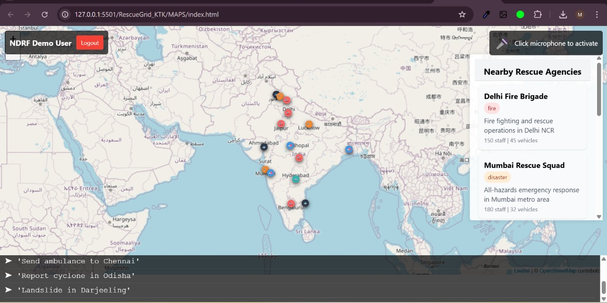

<div align="center">
 
  <h1>RescueGrid: Integrated Disaster Management Platform</h1>
  <p><strong>AI-Powered Crisis Response and Coordination System</strong></p>
  
  [](LICENSE)
  [](https://reactjs.org/)
  [](https://www.python.org/)
  [](https://fastapi.tiangolo.com/)
</div>

## 📋 Table of Contents
- [Overview](#overview)
- [Problem Statement](#problem-statement)
- [Our Solution](#our-solution)
- [System Architecture](#system-architecture)
- [Key Features](#key-features)
  - [Real-time Communication](#real-time-communication)
  - [AI-Powered Weather Forecasting & Disaster Prediction](#ai-powered-weather-forecasting--disaster-prediction)
  - [Interactive Emergency Maps](#interactive-emergency-maps)
  - [Multilingual Disaster Management Chatbot](#multilingual-disaster-management-chatbot)
- [Startup Ecosystem](#startup-ecosystem)
- [Installation & Setup](#installation--setup)
  - [Chat Application](#chat-application)
  - [Recommendation System](#recommendation-system)
  - [Maps Module](#maps-module)
  - [Chatbot Server](#chatbot-server)
- [Usage Guide](#usage-guide)
- [Screenshots](#screenshots)
- [Technologies Used](#technologies-used)
- [Roadmap](#roadmap)
- [Sustainable Development Goals](#sustainable-development-goals)
- [Contributing](#contributing)
- [License](#license)
- [Acknowledgments](#acknowledgments)

## 📑 Overview

RescueGrid is a comprehensive disaster management platform designed to enhance emergency response and coordination during natural and man-made disasters. By integrating real-time communication, AI-powered disaster prediction, interactive mapping, and multilingual support, RescueGrid provides a holistic solution for first responders, emergency management agencies, and affected communities.

## 🌪️ Problem Statement

Disaster response faces critical challenges:

1. **Communication Breakdown**: Traditional communication channels often fail during disasters.
2. **Coordination Difficulties**: Rescue teams struggle to coordinate effectively across agencies.
3. **Information Gaps**: Decision-makers lack real-time, actionable intelligence.
4. **Prediction Limitations**: Current systems provide inadequate advance warnings for emerging threats.
5. **Language Barriers**: Communication challenges in multilingual regions during emergencies.

These issues lead to delayed response times, inefficient resource allocation, and potentially avoidable casualties.

## 💡 Our Solution

RescueGrid addresses these challenges through an integrated platform with four core components:

1. **RescueConnect**: A real-time emergency communication system with priority messaging, multimedia support, and offline capabilities.
2. **WeatherPredict**: AI-driven weather forecasting and disaster prediction tool that provides actionable recommendations.
3. **RescueMap**: Interactive mapping interface for emergency resource coordination and situational awareness.
4. **RescueX India**: Multilingual disaster management chatbot specialized for the Indian context and languages.

## 🏛️ System Architecture

RescueGrid employs a modular microservices architecture for flexibility, scalability, and resilience:

```
┌───────────────────┐     ┌───────────────────┐     ┌───────────────────┐
│   RescueConnect   │     │  WeatherPredict   │     │     RescueMap     │
│   (Chat System)   │     │  (AI Forecasting) │     │ (Resource Mapping)│
└────────┬──────────┘     └────────┬──────────┘     └────────┬──────────┘
         │                         │                         │
         ▼                         ▼                         ▼
┌─────────────────────────────────────────────────────────────────────┐
│                      Integration & Data Exchange Layer              │
└─────────────────────────────────────────────────────────────────────┘
                                     │
                                     ▼
┌───────────────────────────────────────────────────────────────────┐
│                       RescueX India Chatbot                       │
│               (Natural Language Interface & Knowledge Base)       │
└───────────────────────────────────────────────────────────────────┘
```

Each component operates independently while sharing data through secure APIs, enabling both standalone and integrated operation.

## 🔑 Key Features

### Real-time Communication

**RescueConnect** provides mission-critical communication tools:

- **Priority-Based Messaging**: Emergency, warning, and normal communication channels
- **Offline Capability**: Continues functioning with limited connectivity
- **Multi-Media Support**: Text, voice messages, location sharing, and file transfers
- **End-to-End Encryption**: Secure communication for sensitive operations
- **Role-Based Access**: Specialized interfaces for different emergency roles
- **Low-Bandwidth Mode**: Functions in connectivity-constrained environments

### AI-Powered Weather Forecasting & Disaster Prediction

**WeatherPredict** leverages advanced AI for comprehensive weather forecasting and risk assessment:

- **Advanced Weather Forecasting**: High-precision weather predictions up to 10 days in advance
- **Hyperlocal Forecasting**: Block-level weather intelligence for precise emergency planning
- **Satellite Imagery Integration**: Real-time satellite data for accurate storm tracking
- **Multiple Disaster Predictions**: Floods, storms, wildfires, heat waves, earthquakes, etc.
- **Severity Classification**: Risk levels from low to severe/extreme with color-coded alerts
- **Actionable Recommendations**: Practical prevention and response measures
- **Visual Analytics**: Intuitive data visualization and risk mapping with time-series forecasts
- **Historical Pattern Recognition**: Machine learning models trained on decades of weather data
- **Climate Change Impact Analysis**: Long-term disaster trend predictions based on climate models
- **Early Warning System**: Automated alerts delivered hours or days before disaster strikes

### Interactive Emergency Maps

**RescueMap** provides spatial awareness and coordination:

- **Real-Time Resource Tracking**: Live location of emergency resources, shelters, and medical facilities
- **Voice Command Interface**: Hands-free operation for field personnel
- **Agency Coordination**: Inter-agency visibility and communication with shared mapping layers
- **Emergency Alerts**: Geographically targeted notifications with evacuation routes
- **Incident Reporting**: On-the-ground situation updates with photo and video capabilities
- **Offline Maps**: Continued functionality without internet connection
- **3D Terrain Visualization**: Advanced topographical analysis for flood and landslide assessment
- **Heat Maps**: Population density and vulnerability visualization
- **Route Optimization**: AI-powered emergency vehicle routing during disasters
- **Drone Integration**: Live aerial footage overlaid on maps for comprehensive situational awareness

### Multilingual Disaster Management Chatbot

**RescueX India** serves as an accessible knowledge interface:

- **Indian Languages Support**: Hindi, Tamil, Telugu, Bengali, Marathi, and more
- **Disaster-Specific Information**: Specialized guidance for floods, cyclones, earthquakes
- **Voice Interface**: Natural conversation in multiple languages with dialect recognition
- **Emergency Contacts**: Connection to NDRF, SDMA, emergency helplines
- **AI-Powered Responses**: Contextual assistance using Google's Gemini AI
- **Accessible Design**: Mobile-friendly interface optimized for diverse users
- **Interactive Tutorials**: Step-by-step emergency procedures with visual guides
- **Mental Health Support**: Crisis counseling resources and coping strategies
- **Community Assistance**: Connecting volunteers with those in need
- **Offline Knowledge Base**: Critical information available without internet connectivity

## 🚀 Startup Ecosystem

RescueGrid empowers disaster-tech startups and encourages innovation in emergency management:

### Integration Opportunities
- **Open API Platform**: Documented APIs for startups to build complementary solutions
- **Developer Sandbox**: Test environment with simulated disaster data
- **SDK Access**: Software Development Kits for mobile and web applications

### Startup Programs
- **RescueGrid Accelerator**: 6-month program for early-stage disaster-tech startups
- **Innovation Challenges**: Regular hackathons focused on solving specific disaster management problems
- **Venture Funding**: Connection to impact investors specializing in disaster resilience technologies

### Partnership Models
- **Data Sharing Agreements**: Access to anonymized disaster response data for research
- **Co-Development**: Opportunities to enhance core RescueGrid features
- **Go-To-Market Support**: Joint marketing initiatives for complementary solutions

### Success Stories
- **DroneRescue**: UAV startup integrated with RescueMap for aerial reconnaissance
- **VoiceAlert**: Voice-tech startup enhancing multilingual capabilities of RescueX
- **PredictFlow**: AI startup improving flood forecasting algorithms
- **CommRelay**: Mesh network startup expanding offline communication capabilities

## 🛠️ Installation & Setup

### Chat Application

```bash
# Navigate to the chat application directory
cd CHATAPPLICATION/Frontend/vite-project

# Install dependencies
npm install

# Start development server
npm run dev

# Backend setup
cd ../../Backend
npm install
npm start
```

### Recommendation System

```bash
# Navigate to the recommendation system directory
cd RECOMMENDATIONSYSTEM_RESTFUL_API_SERVER_FAST_API

# Set up virtual environment
python -m venv venv
source venv/bin/activate  # On Windows: venv\Scripts\activate

# Install dependencies
pip install -r requirements.txt

# Run the FastAPI server
uvicorn main:app --reload
```

### Maps Module

```bash
# Navigate to the maps directory
cd MAPS

# Serve the application using a local server
# Option 1: Using Python
python -m http.server 8000

# Option 2: Using Node.js
npx serve
```

### Chatbot Server

```bash
# Navigate to the chatbot server directory
cd CHATBOTSERVER

# Set up virtual environment
python -m venv venv
source venv/bin/activate  # On Windows: venv\Scripts\activate

# Install dependencies
pip install -r requirements.txt

# Run the server
python app.py
```

## 📘 Usage Guide

### RescueConnect Chat

1. **Login/Register**: Create an account or sign in with existing credentials
2. **Select Channel**: Join relevant emergency coordination channels
3. **Communication**: Send messages with appropriate priority levels
4. **Share Resources**: Upload images, locations, or other media as needed
5. **Monitor Status**: Track team members and their activity

### WeatherPredict

1. **Enter Location**: Provide the location for prediction analysis
2. **View Results**: Review disaster risks, severity levels, and probabilities
3. **Access Recommendations**: Follow suggested prevention and response measures
4. **Monitor Updates**: Check for changing conditions and updated predictions

### RescueMap

1. **Login**: Authenticate to access the mapping interface
2. **View Resources**: See available emergency resources and their locations
3. **Voice Commands**: Use the microphone for hands-free operation
4. **Agency Coordination**: Connect with relevant agencies
5. **Report Incidents**: Mark and describe emergency situations on the map

### RescueX Chatbot

1. **Access Interface**: Open the chatbot through web or mobile interface
2. **Select Language**: Choose your preferred Indian language
3. **Ask Questions**: Inquire about disaster preparedness or emergency procedures
4. **Get Guidance**: Follow the AI-powered recommendations
5. **Access Contacts**: Connect with emergency services if needed

## 📷 Screenshots

<div align="center">
  
  <p><em>RescueConnect: Emergency Coordination Chat Interface</em></p>
  
  
   
    
     
    <p><em>RescueConnect: Emergency Coordination Chat Interface</em></p>
  
  
  <p><em>RescueMap: Interactive Emergency Resource Coordination</em></p>
  
  
  <p><em>RescueX India: Multilingual Disaster Management Chatbot</em></p>
</div>

## 🧰 Technologies Used

### Frontend
- **React**: Component-based UI development
- **Vite**: Fast development and building
- **Framer Motion**: Smooth animations and transitions
- **Tailwind CSS**: Utility-first styling
- **Socket.IO Client**: Real-time client-server communication

### Backend
- **Node.js**: Runtime environment for backend services
- **Express**: Web framework for API development
- **Socket.IO**: Real-time bidirectional event-based communication
- **FastAPI**: High-performance Python API framework
- **Google Gemini AI**: Advanced natural language processing

### Data & Analytics
- **TensorFlow/PyTorch**: AI and ML for prediction models
- **MongoDB**: Document database for flexible data storage
- **Redis**: In-memory data structure store for caching
- **Pandas/NumPy**: Data analysis and manipulation

### DevOps & Infrastructure
- **Docker**: Containerization for consistent environments
- **NGINX**: Web server and reverse proxy
- **GitHub Actions**: CI/CD pipeline automation
- **Leaflet.js**: Interactive mapping capabilities

## 🛣️ Roadmap

- **Q2 2023**: Integration with government emergency alert systems
- **Q3 2023**: Mobile applications for Android and iOS
- **Q4 2023**: Machine learning enhancements for prediction accuracy
- **Q1 2024**: Expanded language support and international deployment
- **Q2 2024**: Satellite imagery integration for real-time disaster monitoring

## 🌏 Sustainable Development Goals

RescueGrid actively contributes to several UN Sustainable Development Goals (SDGs):

<div align="center">
  
  
  
  
  
</div>

### SDG 3: Good Health and Well-being
- Improving emergency response times to save lives during disasters
- Facilitating better coordination between medical teams in crisis situations
- Providing critical health information through multilingual interfaces

### SDG 9: Industry, Innovation and Infrastructure
- Developing resilient communication infrastructure that functions during emergencies
- Leveraging AI and cutting-edge technology for disaster prediction and management
- Creating innovative solutions for emergency coordination and resource deployment

### SDG 11: Sustainable Cities and Communities
- Enhancing urban resilience through better disaster preparedness and response
- Supporting community-based disaster management initiatives
- Providing tools for sustainable recovery and reconstruction planning

### SDG 13: Climate Action
- Improving early warning systems for climate-related disasters
- Supporting adaptive capacity and resilience to climate hazards
- Facilitating knowledge sharing on climate-related disaster preparedness

### SDG 17: Partnerships for the Goals
- Enabling multi-stakeholder collaboration during emergency response
- Facilitating public-private partnerships for disaster management
- Promoting international cooperation in disaster response and recovery

## 👥 Contributing

We welcome contributions to the RescueGrid platform! Please follow these steps:

1. Fork the repository
2. Create a feature branch (`git checkout -b feature/amazing-feature`)
3. Commit your changes (`git commit -m 'Add some amazing feature'`)
4. Push to the branch (`git push origin feature/amazing-feature`)
5. Open a Pull Request

For major changes, please open an issue first to discuss what you would like to change.

## 📄 License

This project is licensed under the MIT License - see the LICENSE file for details.

## 🙏 Acknowledgments

- [NDRF India](https://ndrf.gov.in/) for emergency management insights
- [Indian Meteorological Department](https://mausam.imd.gov.in/) for weather data
- [Google Gemini AI](https://ai.google/discover/gemini/) for chatbot capabilities
- All contributors and volunteers supporting disaster management initiatives

---

<div align="center">
  <p>Made with ❤️ by the RescueGrid Team | Committed to saving lives through technology</p>
</div>
=======
<div align="center">
  
  <h1>RescueGrid: Integrated Disaster Management Platform</h1>
  <p><strong>AI-Powered Crisis Response and Coordination System</strong></p>
  
  [](LICENSE)
  [](https://reactjs.org/)
  [](https://www.python.org/)
  [](https://fastapi.tiangolo.com/)
</div>

## 📋 Table of Contents
- [Overview](#overview)
- [Problem Statement](#problem-statement)
- [Our Solution](#our-solution)
- [System Architecture](#system-architecture)
- [Key Features](#key-features)
  - [Real-time Communication](#real-time-communication)
  - [AI-Powered Disaster Prediction](#ai-powered-disaster-prediction)
  - [Interactive Emergency Maps](#interactive-emergency-maps)
  - [Multilingual Disaster Management Chatbot](#multilingual-disaster-management-chatbot)
- [Installation & Setup](#installation--setup)
  - [Chat Application](#chat-application)
  - [Recommendation System](#recommendation-system)
  - [Maps Module](#maps-module)
  - [Chatbot Server](#chatbot-server)
- [Usage Guide](#usage-guide)
- [Screenshots](#screenshots)
- [Technologies Used](#technologies-used)
- [Roadmap](#roadmap)
- [Sustainable Development Goals](#sustainable-development-goals)
- [Contributing](#contributing)
- [License](#license)
- [Acknowledgments](#acknowledgments)

## 📑 Overview

RescueGrid is a comprehensive disaster management platform designed to enhance emergency response and coordination during natural and man-made disasters. By integrating real-time communication, AI-powered disaster prediction, interactive mapping, and multilingual support, RescueGrid provides a holistic solution for first responders, emergency management agencies, and affected communities.

## 🌪️ Problem Statement

Disaster response faces critical challenges:

1. **Communication Breakdown**: Traditional communication channels often fail during disasters.
2. **Coordination Difficulties**: Rescue teams struggle to coordinate effectively across agencies.
3. **Information Gaps**: Decision-makers lack real-time, actionable intelligence.
4. **Prediction Limitations**: Current systems provide inadequate advance warnings for emerging threats.
5. **Language Barriers**: Communication challenges in multilingual regions during emergencies.

These issues lead to delayed response times, inefficient resource allocation, and potentially avoidable casualties.

## 💡 Our Solution

RescueGrid addresses these challenges through an integrated platform with four core components:

1. **RescueConnect**: A real-time emergency communication system with priority messaging, multimedia support, and offline capabilities.
2. **DisasterPredict**: AI-driven disaster prediction and risk assessment tool that provides actionable recommendations.
3. **RescueMap**: Interactive mapping interface for emergency resource coordination and situational awareness.
4. **RescueX India**: Multilingual disaster management chatbot specialized for the Indian context and languages.

## 🏛️ System Architecture

RescueGrid employs a modular microservices architecture for flexibility, scalability, and resilience:

```
┌───────────────────┐     ┌───────────────────┐     ┌───────────────────┐
│   RescueConnect   │     │   DisasterPredict │     │     RescueMap     │
│   (Chat System)   │     │  (AI Predictions) │     │ (Resource Mapping)│
└────────┬──────────┘     └────────┬──────────┘     └────────┬──────────┘
         │                         │                         │
         ▼                         ▼                         ▼
┌─────────────────────────────────────────────────────────────────────┐
│                      Integration & Data Exchange Layer              │
└─────────────────────────────────────────────────────────────────────┘
                                     │
                                     ▼
┌───────────────────────────────────────────────────────────────────┐
│                       RescueX India Chatbot                       │
│               (Natural Language Interface & Knowledge Base)       │
└───────────────────────────────────────────────────────────────────┘
```

Each component operates independently while sharing data through secure APIs, enabling both standalone and integrated operation.

## 🔑 Key Features

### Real-time Communication

**RescueConnect** provides mission-critical communication tools:

- **Priority-Based Messaging**: Emergency, warning, and normal communication channels
- **Offline Capability**: Continues functioning with limited connectivity
- **Multi-Media Support**: Text, voice messages, location sharing, and file transfers
- **End-to-End Encryption**: Secure communication for sensitive operations
- **Role-Based Access**: Specialized interfaces for different emergency roles
- **Low-Bandwidth Mode**: Functions in connectivity-constrained environments

### AI-Powered Disaster Prediction

**DisasterPredict** leverages advanced AI for risk assessment:

- **Weather Analysis**: Real-time weather data interpretation
- **Multiple Disaster Predictions**: Floods, storms, wildfires, heat waves, etc.
- **Severity Classification**: Risk levels from low to severe/extreme
- **Actionable Recommendations**: Practical prevention and response measures
- **Visual Analytics**: Intuitive data visualization and risk mapping
- **Historical Pattern Recognition**: Learning from past disasters to predict future events

### Interactive Emergency Maps

**RescueMap** provides spatial awareness and coordination:

- **Real-Time Resource Tracking**: Live location of emergency resources
- **Voice Command Interface**: Hands-free operation for field personnel
- **Agency Coordination**: Inter-agency visibility and communication
- **Emergency Alerts**: Geographically targeted notifications
- **Incident Reporting**: On-the-ground situation updates
- **Offline Maps**: Continued functionality without internet connection

### Multilingual Disaster Management Chatbot

**RescueX India** serves as an accessible knowledge interface:

- **Indian Languages Support**: Hindi, Tamil, Telugu, Bengali, Marathi, and more
- **Disaster-Specific Information**: Specialized guidance for floods, cyclones, earthquakes
- **Voice Interface**: Natural conversation in multiple languages
- **Emergency Contacts**: Connection to NDRF, SDMA, emergency helplines
- **AI-Powered Responses**: Contextual assistance using Google's Gemini AI
- **Accessible Design**: Mobile-friendly interface optimized for diverse users

## 🛠️ Installation & Setup

### Chat Application

```bash
# Navigate to the chat application directory
cd CHATAPPLICATION/Frontend/vite-project

# Install dependencies
npm install

# Start development server
npm run dev

# Backend setup
cd ../../Backend
npm install
npm start
```

### Recommendation System

```bash
# Navigate to the recommendation system directory
cd RECOMMENDATIONSYSTEM_RESTFUL_API_SERVER_FAST_API

# Set up virtual environment
python -m venv venv
source venv/bin/activate  # On Windows: venv\Scripts\activate

# Install dependencies
pip install -r requirements.txt

# Run the FastAPI server
uvicorn main:app --reload
```

### Maps Module

```bash
# Navigate to the maps directory
cd MAPS

# Serve the application using a local server
# Option 1: Using Python
python -m http.server 8000

# Option 2: Using Node.js
npx serve
```

### Chatbot Server

```bash
# Navigate to the chatbot server directory
cd CHATBOTSERVER

# Set up virtual environment
python -m venv venv
source venv/bin/activate  # On Windows: venv\Scripts\activate

# Install dependencies
pip install -r requirements.txt

# Run the server
python app.py
```

## 📘 Usage Guide

### RescueConnect Chat

1. **Login/Register**: Create an account or sign in with existing credentials
2. **Select Channel**: Join relevant emergency coordination channels
3. **Communication**: Send messages with appropriate priority levels
4. **Share Resources**: Upload images, locations, or other media as needed
5. **Monitor Status**: Track team members and their activity

### DisasterPredict

1. **Enter Location**: Provide the location for prediction analysis
2. **View Results**: Review disaster risks, severity levels, and probabilities
3. **Access Recommendations**: Follow suggested prevention and response measures
4. **Monitor Updates**: Check for changing conditions and updated predictions

### RescueMap

1. **Login**: Authenticate to access the mapping interface
2. **View Resources**: See available emergency resources and their locations
3. **Voice Commands**: Use the microphone for hands-free operation
4. **Agency Coordination**: Connect with relevant agencies
5. **Report Incidents**: Mark and describe emergency situations on the map

### RescueX Chatbot

1. **Access Interface**: Open the chatbot through web or mobile interface
2. **Select Language**: Choose your preferred Indian language
3. **Ask Questions**: Inquire about disaster preparedness or emergency procedures
4. **Get Guidance**: Follow the AI-powered recommendations
5. **Access Contacts**: Connect with emergency services if needed

## 📷 Screenshots

<div align="center">
  
  <p><em>RescueConnect: Emergency Coordination Chat Interface</em></p>
  
  
  <p><em>DisasterPredict: AI-Powered Risk Assessment</em></p>
  
  
  <p><em>RescueMap: Emergency Resource Coordination</em></p>
  
  
  <p><em>RescueX India: Multilingual Disaster Management Chatbot</em></p>
</div>

## 🧰 Technologies Used

### Frontend
- **React**: Component-based UI development
- **Vite**: Fast development and building
- **Framer Motion**: Smooth animations and transitions
- **Tailwind CSS**: Utility-first styling
- **Socket.IO Client**: Real-time client-server communication

### Backend
- **Node.js**: Runtime environment for backend services
- **Express**: Web framework for API development
- **Socket.IO**: Real-time bidirectional event-based communication
- **FastAPI**: High-performance Python API framework
- **Google Gemini AI**: Advanced natural language processing

### Data & Analytics
- **TensorFlow/PyTorch**: AI and ML for prediction models
- **MongoDB**: Document database for flexible data storage
- **Redis**: In-memory data structure store for caching
- **Pandas/NumPy**: Data analysis and manipulation

### DevOps & Infrastructure
- **Docker**: Containerization for consistent environments
- **NGINX**: Web server and reverse proxy
- **GitHub Actions**: CI/CD pipeline automation
- **Leaflet.js**: Interactive mapping capabilities

## 🛣️ Roadmap

- **Q2 2023**: Integration with government emergency alert systems
- **Q3 2023**: Mobile applications for Android and iOS
- **Q4 2023**: Machine learning enhancements for prediction accuracy
- **Q1 2024**: Expanded language support and international deployment
- **Q2 2024**: Satellite imagery integration for real-time disaster monitoring

## 🌏 Sustainable Development Goals

RescueGrid actively contributes to several UN Sustainable Development Goals (SDGs):

<div align="center">
  
  
  
  
  
</div>

### SDG 3: Good Health and Well-being
- Improving emergency response times to save lives during disasters
- Facilitating better coordination between medical teams in crisis situations
- Providing critical health information through multilingual interfaces

### SDG 9: Industry, Innovation and Infrastructure
- Developing resilient communication infrastructure that functions during emergencies
- Leveraging AI and cutting-edge technology for disaster prediction and management
- Creating innovative solutions for emergency coordination and resource deployment

### SDG 11: Sustainable Cities and Communities
- Enhancing urban resilience through better disaster preparedness and response
- Supporting community-based disaster management initiatives
- Providing tools for sustainable recovery and reconstruction planning

### SDG 13: Climate Action
- Improving early warning systems for climate-related disasters
- Supporting adaptive capacity and resilience to climate hazards
- Facilitating knowledge sharing on climate-related disaster preparedness

### SDG 17: Partnerships for the Goals
- Enabling multi-stakeholder collaboration during emergency response
- Facilitating public-private partnerships for disaster management
- Promoting international cooperation in disaster response and recovery

## 👥 Contributing

We welcome contributions to the RescueGrid platform! Please follow these steps:

1. Fork the repository
2. Create a feature branch (`git checkout -b feature/amazing-feature`)
3. Commit your changes (`git commit -m 'Add some amazing feature'`)
4. Push to the branch (`git push origin feature/amazing-feature`)
5. Open a Pull Request

For major changes, please open an issue first to discuss what you would like to change.

## 📄 License

This project is licensed under the MIT License - see the LICENSE file for details.

## 🙏 Acknowledgments

- [NDRF India](https://ndrf.gov.in/) for emergency management insights
- [Indian Meteorological Department](https://mausam.imd.gov.in/) for weather data
- [Google Gemini AI](https://ai.google/discover/gemini/) for chatbot capabilities
- All contributors and volunteers supporting disaster management initiatives

---

<div align="center">
  <p>Made with ❤️ by the RescueGrid Team | Committed to saving lives through technology</p>
</div>
#
>>>>>>> 330c53ec597769fb0ac15b1ecba7632cd8461f8f
